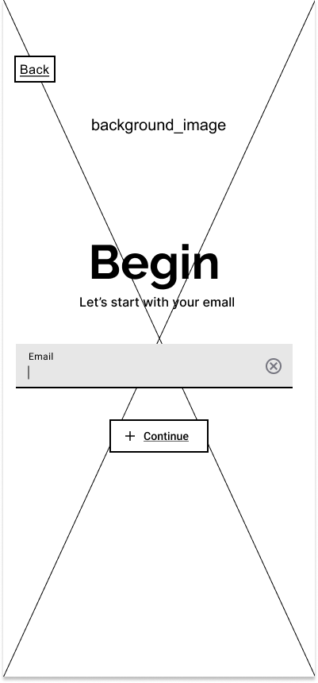
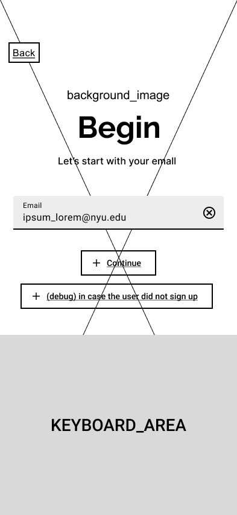
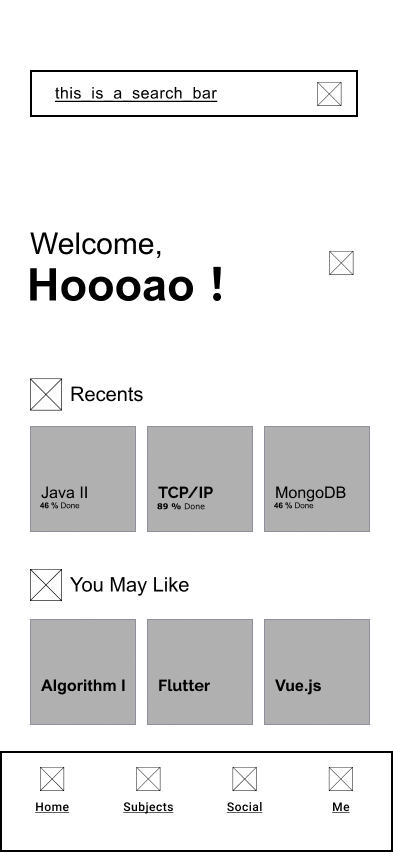
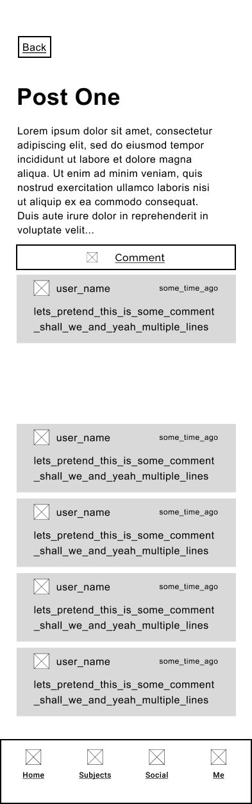
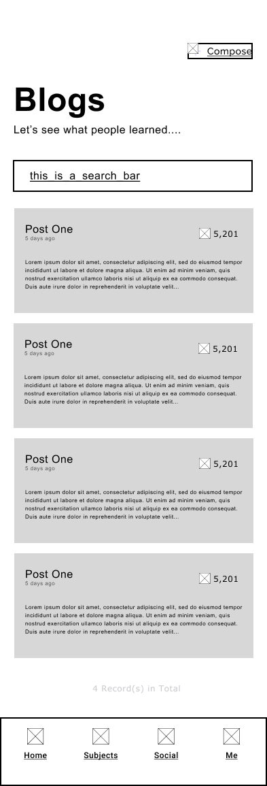
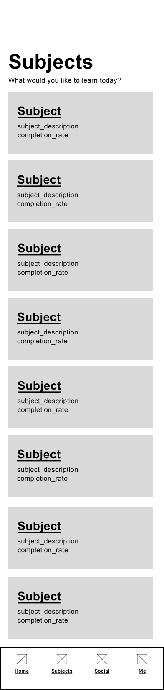
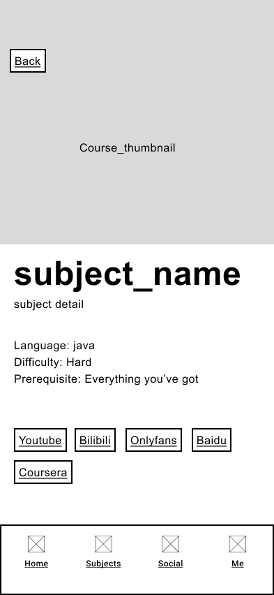

# User Experience Design

## Prototype
    

## App Map & Wireframes

### App Map:

<figure>

<figcaption><b>App Map</b></figcaption>

</figure>

### Wireframes:

<figure>
<figcaption><b>Email_login</b></figcaption>

</figure>

  

<figure>

<figcaption><b>Email_login_k</b></figcaption>

</figure>

<figure>

<figcaption><b>Password_login_k</b></figcaption>

</figure>

<figure>

<figcaption><b>Password_singup_k</b></figcaption>

</figure>

<figure>

<figcaption><b>Welcome</b></figcaption>

</figure>

<figure>

<figcaption><b>Profile</b></figcaption>

</figure>

<figure>

<figcaption><b>Edit_profile</b></figcaption>

</figure>

<figure>

<figcaption><b>Select_avatar</b></figcaption>

</figure>

<figure>

<figcaption><b>Post_details</b></figcaption>

</figure>

<figure>

<figcaption><b>Comment&Compose</b></figcaption>

</figure>

<figure>

<figcaption><b>Blogs</b></figcaption>

</figure>

<figure>

<figcaption><b>Search_from_blogs</b></figcaption>

</figure>

<figure>

<figcaption><b>Subjects</b></figcaption>

</figure>

<figure>

<figcaption><b>Subject_detail</b></figcaption>

</figure>

<figure>

<figcaption><b>Play_screen</b></figcaption>

</figure>

